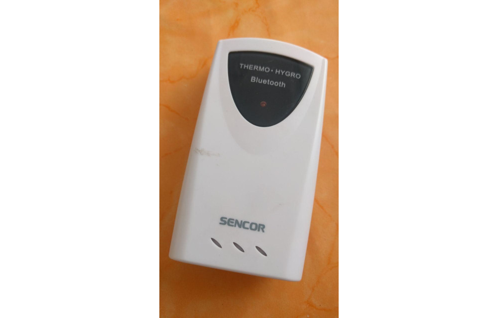

# Sencor SWS 500 Weather Sensor Poller

Sample development Python scripts for reading data from the Sencor SWS 500
Outdoor Thermo/Humidity Meter Bluetooth LE device.

## Details

The goal of this project is to push the weather data extracted from the
device to some advanced collector/integrator services (like [ThingsBoard](https://thingsboard.io/)
or [Home Assistant](https://www.home-assistant.io/)).

There are three sample scripts implementing the BLE communication: one uses the
[bluepy](https://github.com/IanHarvey/bluepy) interface, an other one
uses the multi-platform
[bleak](https://github.com/hbldh/bleak) library, and the last one uses
[pygatt](https://github.com/peplin/pygatt).

The [sencor-pygatt.py](./sencor-pygatt.py) implementation has built-in MQTT support (with
client certificate authentication) for integrating it with [Home Assistant](https://www.home-assistant.io/) easily.

There is also an archived and deprecated APK communicating with the
device called Sencor Meter (com.teusoft.sencor_meter). It is
[available for download](https://apkpure.com/sencor-meter/com.teusoft.sencor_meter)
at [Apkpure](https://apkpure.com). It was useful for reversing the data format,
but it was not working on "recent" (LineageOS 15.1 ~ Android 8.1)
Android devices.

## About the device



The [sencor-bleak-enum.py](./sencor-bleak-enum.py) script scans for the
Sencor SWS 500 device (identifies it by Model Number `NGE76`), lists
the available services and enumerate the service details (characteristics
and descriptors).

The characteristic values enumerated from the Device Information service
gives some description about the device:

| Characteristic    | Value      |
| ----------------- | ---------- |
| Manufacturer Name | SPARK      |
| Model Number      | NGE76      |
| Serial Number     | 20131120   |
| Software Revision | SW VER 1.0 |
| Hardware Revision | HW VER 1.0 |
| Firmware Revision | FW VER 1.0 |

The Temperature Measurement (notify) characteristic under the
Health Thermometer service can be used to enumerate the Thermo/Humidity
data.

The device stores data from the last 24 hours and the whole archive is
served once a client registers for the notify characteristic.

The data format is 5-byte binary object (v[0:4]) for every observation:

| v[0] | v[1] | v[2]   | v[3] - 40       | v[4]        |
|------|------|--------|-----------------|-------------|
|type  |count |channel2|temperature in ℃ |humidity in %|

The *count* shows when the data was recorded (count=1 (with type=0) means the last observation).
The *channel2* is the hardware switch on the device (it was used by the deprecated
Android app for distinguish up to 3 different devices).

There is also a Battery Level (read, notify) characteristic under
Battery Service to enumerate the current battery state (in a percent scale).

NOTE: The bluetooth interface on the device (due to battery saving)
goes to sleep and wakes up only for short durations between the longer
sleep periods. This is the reason why the scripts have to retry and
sometimes gives error messages (what is normal).

Also, this makes almost impossible to poll the data reliable using a Raspberry
device if the WiFi is enabled while the Bluetooth is active because of
some interference. If the internal WiFi is enabled, a separate Bluetooth Dongle
should be used (or separate WiFi device + internal Bluetooth).

## The scripts in action


## Running on DD-WRT

In my setup I use the [sencor-pygatt.py](./sencor-pygatt.py) script for getting outdoor temperature
on an [Asus RT-AC68U DD-WRT device](https://wiki.dd-wrt.com/wiki/index.php/Asus_RT-AC68U) with a BLE USB Dongle
(ID 0a12:0001), connecting to my Home Assistant instance running on a Raspberry Pi 3. (This multi-device setup is needed for
covering Wi-Fi + BLE ranges.)

Customizing the DD-WRT by [installing Entware](https://wiki.dd-wrt.com/wiki/index.php/Installing_Entware)
is highly recommended.

Unfortunately, even with Entware, DD-WRT lacks Bluetooth modules and related device drivers. Bluetooth
support should be compiled and added manually.

### Adding Bluetooth kernel modules

The [DD-WRT Development wiki page](https://wiki.dd-wrt.com/wiki/index.php/Development)
contains information about compiling extra kernel modules for a running firmware.

Fetch the complete DD-WRT source tree:

```
svn co svn://svn.dd-wrt.com/DD-WRT
```

Also get the binary [toolchain](https://download1.dd-wrt.com/dd-wrtv2/downloads/toolchains/toolchains.tar.xz) for
cross-compiling.

Add the appropriate toolchain binary folder to the path (the arch is ARM Cortex A9 for the Asus RT-AC68U device,
it may be something else for others):

```
PATH=$PATH:/home/builder/toolchain/toolchain-arm_cortex-a9_gcc-8.2.0_musl_eabi/bin
```

Dive into the appropriate Linux kernel source directory in the DD-WRT source tree
(the kernel version is 4.4.x for the current DD-WRT firmware on the Asus RT-AC68U):

```
cd DD-WRT/src/linux/universal/linux-4.4
```

Start from a compatible kernel configuration:

```
cp .config_northstar_smp .config
```

And configure the Bluetooth modules for compile (using ARCH=arm env var for make is necessary)

```
ARCH=arm make menuconfig
```

If there is some issues about missing or improperly configured modules, feel free to remove it
from the Kconfig (e.g. from drivers/net/wireless/Kconfig), only the Bluetooth modules are important now.

After configured, build should be the next step:

```
ARCH=arm make modules
```

If build succeeds, copy the bluetooth modules to the DD-WRT firmware (to jffs for persistance):

```
lib/crc16.ko
net/bluetooth/bluetooth.ko
drivers/base/regmap/regmap-core.ko
driver/bluetooth/btbcm.ko
driver/bluetooth/btintel.ko
driver/bluetooth/btrtl.ko
driver/bluetooth/btusb.ko
```

Using insmod, the modules can be loaded to the kernel on the DD-WRT device.

### Persistent Bluetooth Support

For making the module loading persistent across reboots, a startup script file (with executable permissions)
could be created in `/jffs/etc/config/02-bluetooth.startup`:

```bash
#!/bin/sh
#

/sbin/insmod /opt/root/bluetooth-kmod/crc16.ko
/sbin/insmod /opt/root/bluetooth-kmod/regmap-core.ko
/sbin/insmod /opt/root/bluetooth-kmod/bluetooth.ko
/sbin/insmod /opt/root/bluetooth-kmod/btbcm.ko
/sbin/insmod /opt/root/bluetooth-kmod/btintel.ko
/sbin/insmod /opt/root/bluetooth-kmod/btrtl.ko
/sbin/insmod /opt/root/bluetooth-kmod/btusb.ko

/opt/bin/hciconfig hci0 up
/opt/bin/btmgmt le on
```

For `/opt` folder working (across reboots) I had to bind-mount it during startup
(with `/jffs/etc/config/01-mount.startup`):

```bash
#!/bin/sh

/bin/mount -o bind /jffs/opt /opt
```

### Running the pygatt script

For running [sencor-pygatt.py](./sencor-pygatt.py), dependencies should be installed:

```
opkg install bluez-libs
opkg install bluez-utils
opkg install bluez-utils-extra
opkg install python3
opkg install python3-pip
pip install pygatt
pip install pexpect
pip install paho-mqtt
```

Launching the script from a `/jffs/etc/config/*.startup` file is preferred. I use it
with `screen -d -m` for making the output and logging available on a screen session.

