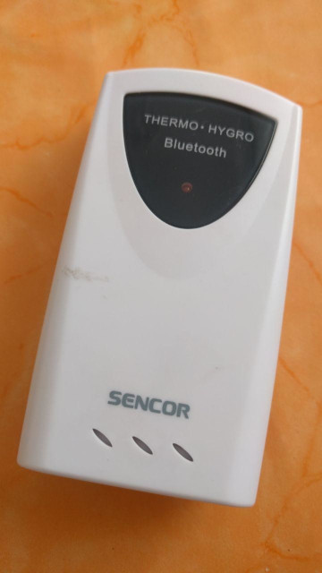
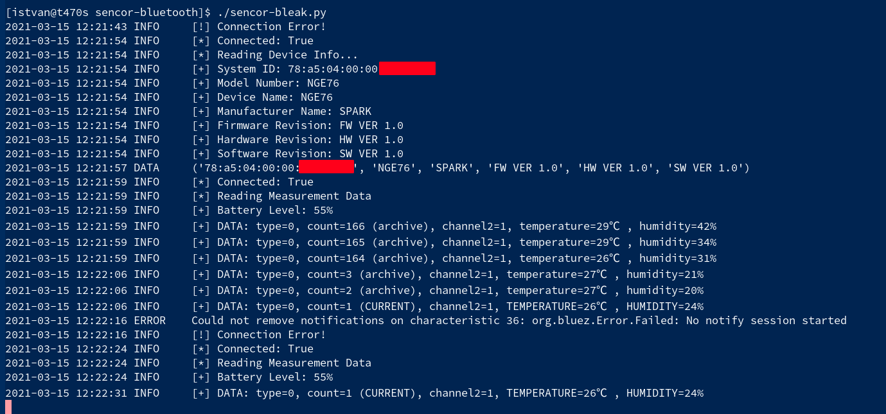

# Sencor SWS 500 Weather Sensor Poller

Sample development Python scripts for reading data from the Sencor SWS 500
Outdoor Thermo/Humidity Meter Bluetooth LE device.

## Details

The goal of this project is to push the weather data extracted from the
device to some advanced collector services (like [ThingsBoard](https://thingsboard.io/)).

There are two sample scripts implementing the BLE communication: one uses the
[bluepy](https://github.com/IanHarvey/bluepy) interface and the other one
uses the multi-platform
[bleak](https://github.com/hbldh/bleak) library.

There is also an archived and deprecated APK communicating with the
device called Sencor Meter (com.teusoft.sencor_meter). It is
[available for download](https://apkpure.com/sencor-meter/com.teusoft.sencor_meter)
at [Apkpure](https://apkpure.com). It was useful for reversing the data format,
but it was not working on "recent" (LineageOS 15.1 ~ Android 8.1)
Android devices.

## About the device

The [sencor-bleak-enum.py](./sencor-bleak-enum.py) script scans for the
Sencor SWS 500 device (identifies it by Model Number `NGE76`), lists
the available services and enumerate the service details (characteristics
and descriptors).

The characteristic values enumerated from the Device Information service
gives some description about the device:

| Characteristic    | Value      |
| ----------------- | ---------- |
| Manufacturer Name | SPARK      |
| Model Number      | NGE76      |
| Serial Number     | 20131120   |
| Software Revision | SW VER 1.0 |
| Hardware Revision | HW VER 1.0 |
| Firmware Revision | FW VER 1.0 |

The Temperature Measurement (notify) characteristic under the
Health Thermometer service can be used to enumerate the Thermo/Humidity
data.

The device stores data from the last 24 hours and the whole archive is
served once a client registers for the notify characteristic.

The data format is 5-byte binary object (v[0:4]) for every observation:

| v[0] | v[1] | v[2]   | v[3] - 40       | v[4]        |
|------|------|--------|-----------------|-------------|
|type  |count |channel2|temperature in ℃ |humidity in %|

The *count* shows when the data was recorded (count=1 means the last observation).
The *channel2* is the hardware switch on the device (it was used by the deprecated
Android app for distinguish up to 3 different devices).

There is also a Battery Level (read, notify) characteristic under
Battery Service to enumerate the current battery state (in a percent scale).

NOTE: The bluetooth interface on the device (due to battery saving)
goes to sleep and wakes up only for short durations between the longer
sleep periods. This is the reason why the scripts have to retry and
sometimes gives error messages (what is normal).

Also, this makes almost impossible to poll the data reliable using a Raspberry
device if the WiFi is enabled while the Bluetooth is active because of
some interference. If the internal WiFi is enabled, a separate Bluetooth Dongle
should be used (or separate WiFi device + internal Bluetooth).

## The scripts in action

